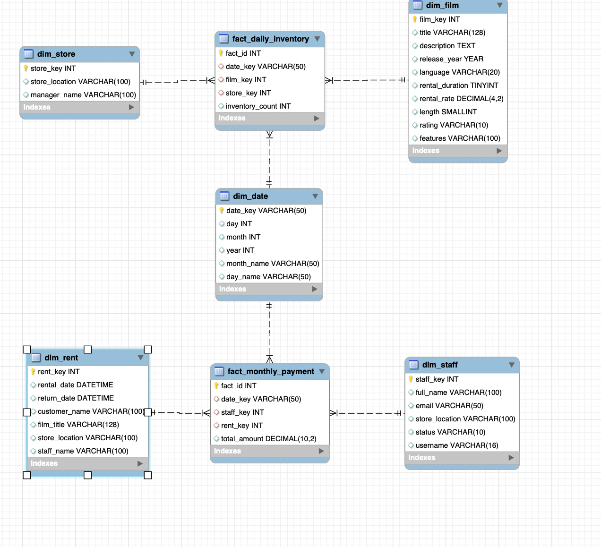
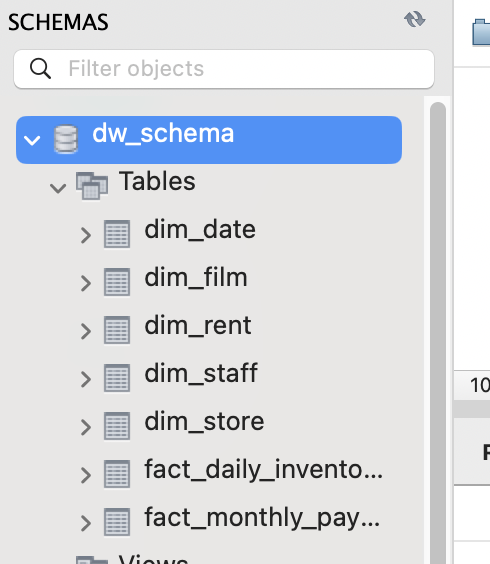

# 🎬 Rental Data Warehouse Project

This project implements a data warehouse for a film rental company. It includes:

- 📐 Dimensional modeling using MySQL Workbench
- ⚙️ ETL process in Python using pandas and SQLAlchemy
- 📊 Visualizations to explore and analyze rental behavior

---

## 🛠️ Tools & Technologies

- MySQL Workbench (Dimensional Modeling)
- Python (ETL with pandas, SQLAlchemy)
- Jupyter Notebook
- Seaborn & Matplotlib (Visualization)

---

## 🧠 Fact & Dimension Tables

The data warehouse includes:

- `dim_date`
- `dim_film`
- `dim_rent`
- `dim_staff`
- `dim_store`
- `fact_daily_inventory`
- `fact_monthly_payment`

---

## 📊 Visualizations

Includes insights like:

- Top rented films
- Inventory trends over time
- Rentals by day of the week

---

## 📷 Screenshots

---

## ✅ How to Run

1. Set up a MySQL instance and import the schema.
2. Run `etl_pipeline.ipynb` to populate tables.
3. Explore visualizations at the end of the notebook.

---

## 📬 Contact

Feel free to reach out with questions or feedback!
)

